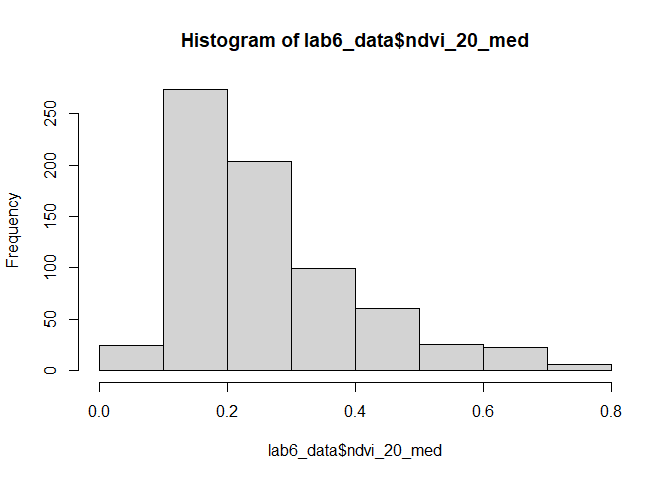
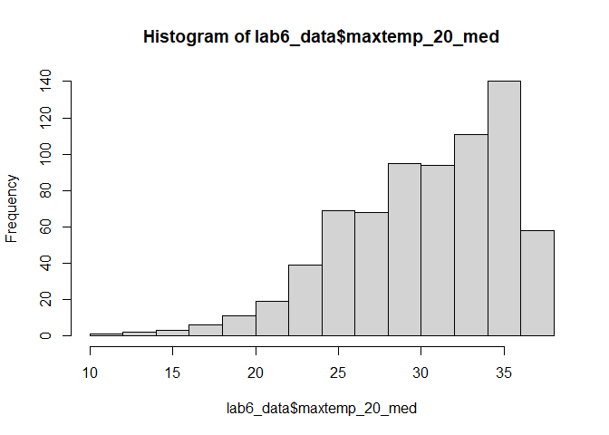
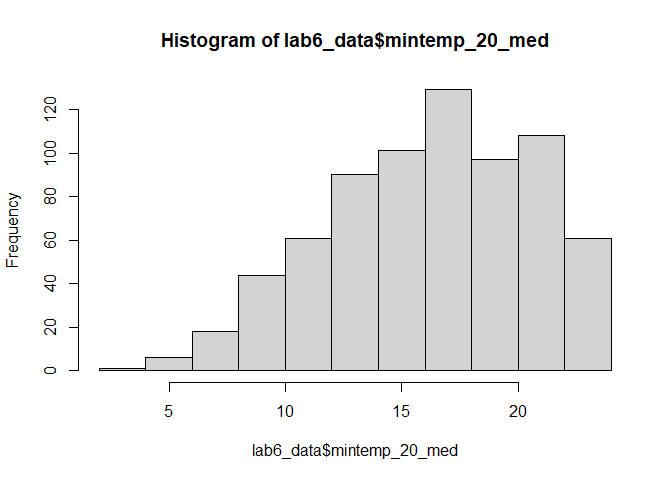
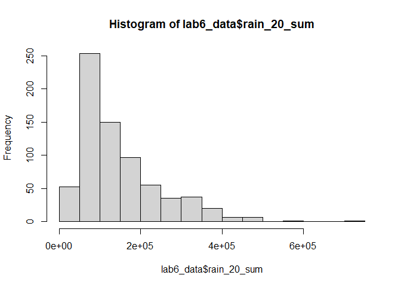
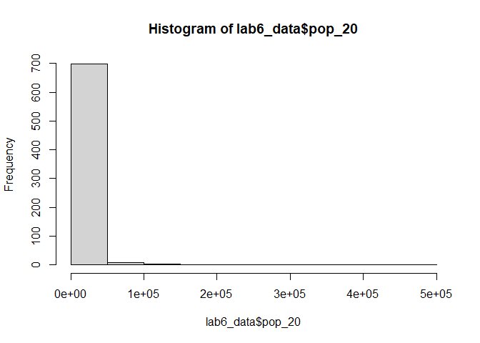
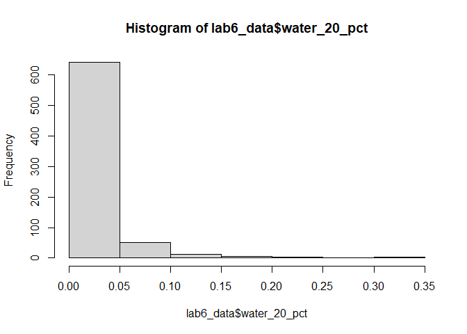
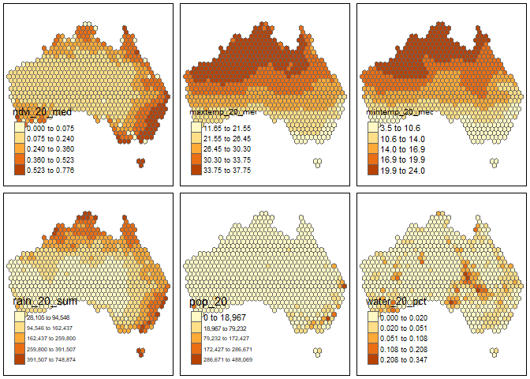
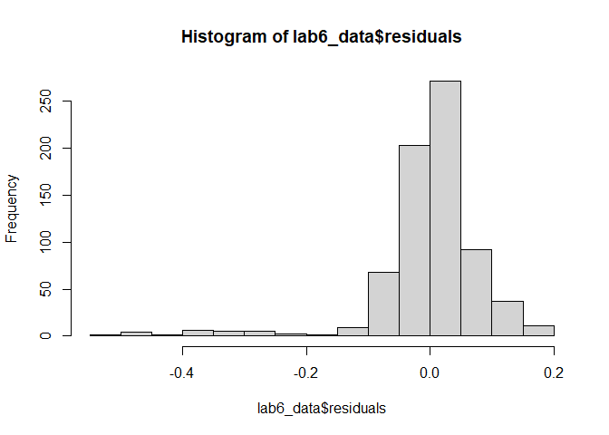
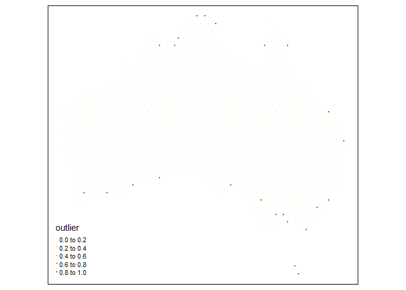
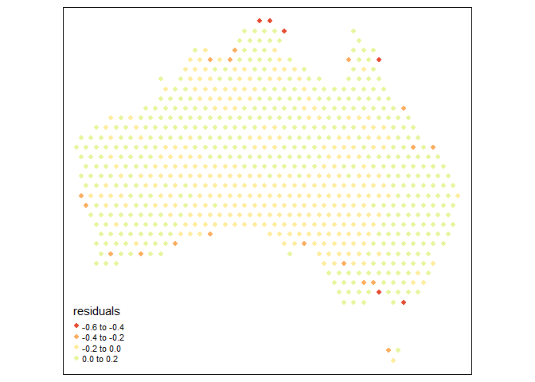

Geog6300: Lab 6
================

## Regression

``` r
library(sf)
library(tidyverse)
```

**Overview:** This lab focuses on regression techniques. You’ll be
analyzing the association of various physical and climatological
characteristics in Australia with observations of several animals
recorded on the citizen science app iNaturalist.

\###Data and research questions###

Let’s import the dataset.

``` r
lab6_data<-st_read("data/aus_climate_inat.gpkg")
```

    ## Reading layer `aus_climate_inat' from data source 
    ##   `C:\Users\micah\OneDrive - University of Georgia\GEOG 4100 Data Science\geog4-6300-lab-6-mduanes\data\aus_climate_inat.gpkg' 
    ##   using driver `GPKG'
    ## Simple feature collection with 716 features and 22 fields
    ## Geometry type: POLYGON
    ## Dimension:     XY
    ## Bounding box:  xmin: 113.875 ymin: -43.38632 xmax: 153.375 ymax: -11.92074
    ## Geodetic CRS:  WGS 84 (CRS84)

The dataset for this lab is a 1 decimal degree hexagon grid that has
aggregate statistics for a number of variables:

- ndvi: NDVI/vegetation index values from Landsat data (via Google Earth
  Engine). These values range from -1 to 1, with higher values
  indicating more vegetation.
- maxtemp_00/20_med: Median maximum temperature (C) in 2000 or 2020
  (data from SILO/Queensland government)
- mintemp_00/20_med: Median minimum temperature (C) in 2020 or 2020
  (data from SILO/Queensland government)
- rain_00/20_sum: Total rainfall (mm) in 2000 or 2020 (data from
  SILO/Queensland government)
- pop_00/20: Total population in 2000 or 2020 (data from NASA’s Gridded
  Population of the World)
- water_00/20_pct: Percentage of land covered by water at some point
  during the year in 2000 or 2020
- elev_med: Median elevation (meters) (data from the Shuttle Radar
  Topography Mission/NASA)

There are also observation counts from iNaturalist for several
distinctively Australian animal species: the central bearded dragon, the
common emu, the red kangaroo, the agile wallaby, the laughing
kookaburra, the wombat, the koala, and the platypus.

Our primary research question is how the climatological/physical
variables in our dataset are predictive of the NDVI value. We will build
models for 2020 as well as the change from 2000 to 2020. The second is
referred to as a “first difference” model and can sometimes be more
useful for identifying causal mechanisms.

\###Part 1: Analysis of 2020 data###

We will start by looking at data for 2020.

**Question 1** *Create histograms for NDVI, max temp., min temp., rain,
and population, and water in 2020 as well as elevation. Based on these
graphs, assess the normality of these variables.*

``` r
#Code goes here.
hist(lab6_data$ndvi_20_med)
```

<!-- -->

``` r
# not normal, rs

hist(lab6_data$maxtemp_20_med)
```

<!-- -->

``` r
# not normal, ls

hist(lab6_data$mintemp_20_med)
```

<!-- -->

``` r
# not normal, ls

hist(lab6_data$rain_20_sum)
```

<!-- -->

``` r
# not normal, rs

hist(lab6_data$pop_20)
```

<!-- -->

``` r
# not normal, very rs

hist(lab6_data$water_20_pct)
```

<!-- -->

``` r
# not normal, very rs
```

None of the assessed variables were close to being normal. NDVI, rain,
population, and water were all heavily right skewed, while temperature
(max and min) were both moderately left skewed.

**Question 2** *Use tmap to map these same variables using Jenks natural
breaks as the classification method. For an extra challenge, use
`tmap_arrange` to plot all maps in a single figure.*

``` r
library(tmap)
```

    ## Breaking News: tmap 3.x is retiring. Please test v4, e.g. with
    ## remotes::install_github('r-tmap/tmap')

``` r
map <- function(var) {
tm_shape(lab6_data) +
  tm_polygons(col=var,style="jenks")
}

ndvi <- map("ndvi_20_med")
max_temp <- map("maxtemp_20_med")
min_temp <- map("mintemp_20_med")
rain <- map("rain_20_sum")
population <- map("pop_20")
water <- map("water_20_pct")

tmap_arrange(ndvi,max_temp,min_temp,rain,population,water)
```

    ## Legend labels were too wide. The labels have been resized to 0.56, 0.56, 0.56, 0.56, 0.56. Increase legend.width (argument of tm_layout) to make the legend wider and therefore the labels larger.

    ## Legend labels were too wide. The labels have been resized to 0.56, 0.56, 0.56, 0.56, 0.56. Increase legend.width (argument of tm_layout) to make the legend wider and therefore the labels larger.

    ## Legend labels were too wide. The labels have been resized to 0.48, 0.44, 0.41, 0.41, 0.41. Increase legend.width (argument of tm_layout) to make the legend wider and therefore the labels larger.

    ## Some legend labels were too wide. These labels have been resized to 0.48, 0.44, 0.41, 0.41. Increase legend.width (argument of tm_layout) to make the legend wider and therefore the labels larger.

    ## Legend labels were too wide. The labels have been resized to 0.56, 0.56, 0.56, 0.56, 0.56. Increase legend.width (argument of tm_layout) to make the legend wider and therefore the labels larger.

<!-- -->

**Question 3** *Based on the maps from question 3, summarise major
patterns you see in the spatial distribution of these data from any of
your variables of interest. How do they appear to be associated with the
NDVI variable?*

The biggest trend I noticed was that temperatures were very high in the
northern portion of Australia compared to the south. NDVI and rain were
both highest along the coast, which makes sense given that you would
expect rain and vegetation to correlate. NDVI was highest in the
southeast, but was still relatively high in the north, but nonexitent in
the center of the country. Population was highest in the southeastern
portion of the continent, and water cover was highest in the center-east
of the country. Overall, rain seemed to be most closely positively
associated with NDVI, with population as a small second. Higher min/max
temperatures seemed to be slightly negatively associated with NDVI, but
not strongly. Water cover also appeared to be negatively associated with
NDVI.

**Question 4** *Create univariate models for each of the variables
listed in question 1, with NDVI in 2020 as the dependent variable. Print
a summary of each model. Write a summary of those results that indicates
the direction, magnitude, and significance for each model coefficient.*

``` r
# ndvi_20_med
# maxtemp_20_med
# mintemp_20_med
# rain_20_sum
# pop_20
# water_20_pct

model_maxtemp <- lm(ndvi_20_med~maxtemp_20_med,data=lab6_data)
summary(model_maxtemp)
```

    ## 
    ## Call:
    ## lm(formula = ndvi_20_med ~ maxtemp_20_med, data = lab6_data)
    ## 
    ## Residuals:
    ##      Min       1Q   Median       3Q      Max 
    ## -0.41874 -0.07657 -0.01927  0.06833  0.36382 
    ## 
    ## Coefficients:
    ##                  Estimate Std. Error t value Pr(>|t|)    
    ## (Intercept)     0.6612389  0.0294372   22.46   <2e-16 ***
    ## maxtemp_20_med -0.0130902  0.0009601  -13.63   <2e-16 ***
    ## ---
    ## Signif. codes:  0 '***' 0.001 '**' 0.01 '*' 0.05 '.' 0.1 ' ' 1
    ## 
    ## Residual standard error: 0.1251 on 714 degrees of freedom
    ## Multiple R-squared:  0.2066, Adjusted R-squared:  0.2055 
    ## F-statistic: 185.9 on 1 and 714 DF,  p-value: < 2.2e-16

``` r
model_mintemp <- lm(ndvi_20_med~mintemp_20_med,data=lab6_data)
summary(model_mintemp)
```

    ## 
    ## Call:
    ## lm(formula = ndvi_20_med ~ mintemp_20_med, data = lab6_data)
    ## 
    ## Residuals:
    ##      Min       1Q   Median       3Q      Max 
    ## -0.36375 -0.08418 -0.03047  0.06972  0.40383 
    ## 
    ## Coefficients:
    ##                 Estimate Std. Error t value Pr(>|t|)    
    ## (Intercept)     0.464461   0.018997   24.45   <2e-16 ***
    ## mintemp_20_med -0.012282   0.001131  -10.86   <2e-16 ***
    ## ---
    ## Signif. codes:  0 '***' 0.001 '**' 0.01 '*' 0.05 '.' 0.1 ' ' 1
    ## 
    ## Residual standard error: 0.1301 on 714 degrees of freedom
    ## Multiple R-squared:  0.1418, Adjusted R-squared:  0.1406 
    ## F-statistic:   118 on 1 and 714 DF,  p-value: < 2.2e-16

``` r
model_rain <- lm(ndvi_20_med~rain_20_sum,data=lab6_data)
summary(model_rain)
```

    ## 
    ## Call:
    ## lm(formula = ndvi_20_med ~ rain_20_sum, data = lab6_data)
    ## 
    ## Residuals:
    ##      Min       1Q   Median       3Q      Max 
    ## -0.56681 -0.04753 -0.01210  0.04599  0.30930 
    ## 
    ## Coefficients:
    ##              Estimate Std. Error t value Pr(>|t|)    
    ## (Intercept) 1.303e-01  7.060e-03   18.45   <2e-16 ***
    ## rain_20_sum 9.124e-07  3.953e-08   23.08   <2e-16 ***
    ## ---
    ## Signif. codes:  0 '***' 0.001 '**' 0.01 '*' 0.05 '.' 0.1 ' ' 1
    ## 
    ## Residual standard error: 0.1063 on 714 degrees of freedom
    ## Multiple R-squared:  0.4273, Adjusted R-squared:  0.4265 
    ## F-statistic: 532.6 on 1 and 714 DF,  p-value: < 2.2e-16

``` r
model_pop <- lm(ndvi_20_med~pop_20,data=lab6_data)
summary(model_pop)
```

    ## 
    ## Call:
    ## lm(formula = ndvi_20_med ~ pop_20, data = lab6_data)
    ## 
    ## Residuals:
    ##      Min       1Q   Median       3Q      Max 
    ## -0.47003 -0.07883 -0.03949  0.06384  0.48974 
    ## 
    ## Coefficients:
    ##              Estimate Std. Error t value Pr(>|t|)    
    ## (Intercept) 2.552e-01  5.013e-03  50.902   <2e-16 ***
    ## pop_20      1.500e-06  1.500e-07   9.998   <2e-16 ***
    ## ---
    ## Signif. codes:  0 '***' 0.001 '**' 0.01 '*' 0.05 '.' 0.1 ' ' 1
    ## 
    ## Residual standard error: 0.1316 on 714 degrees of freedom
    ## Multiple R-squared:  0.1228, Adjusted R-squared:  0.1216 
    ## F-statistic: 99.97 on 1 and 714 DF,  p-value: < 2.2e-16

``` r
model_water <- lm(ndvi_20_med~water_20_pct,data=lab6_data)
summary(model_water)
```

    ## 
    ## Call:
    ## lm(formula = ndvi_20_med ~ water_20_pct, data = lab6_data)
    ## 
    ## Residuals:
    ##      Min       1Q   Median       3Q      Max 
    ## -0.26898 -0.08838 -0.04838  0.06871  0.50911 
    ## 
    ## Coefficients:
    ##               Estimate Std. Error t value Pr(>|t|)    
    ## (Intercept)   0.268988   0.006287  42.781   <2e-16 ***
    ## water_20_pct -0.178263   0.154480  -1.154    0.249    
    ## ---
    ## Signif. codes:  0 '***' 0.001 '**' 0.01 '*' 0.05 '.' 0.1 ' ' 1
    ## 
    ## Residual standard error: 0.1403 on 714 degrees of freedom
    ## Multiple R-squared:  0.001862,   Adjusted R-squared:  0.0004636 
    ## F-statistic: 1.332 on 1 and 714 DF,  p-value: 0.2489

Maxtemp: very significant (~0) associated. Solid negative (-0.13 ndvi
for each degree temperature, which is quite large given the range of the
index). Mintemp: Essentially the same as above, very significant (~0)
associated. Solid negative (-0.12 ndvi for each degree temperature).
Rain: Very significant (~0) effect. The effect was positive, but was
very very small, essentially the same as 0. The R2 was not bad at 0.42,
though. The relative smallness of the effect is likely attributable to
the large range of the variable. The max of this variable 748,873,
making the potential effect quite large. So, despite a small
coefficient, the potential magnitude of this variable is actually quite
high. Population: Similar to rain. Very significant (~0) and positive,
but very very small, again close to 0. Like with the rain variable, this
is likely to be due to the large range of the variable (max of 488,069).
So, despite a small coefficient, the potential magnitude of this
variable is actually quite high. Water: Not significant finding (0.25
p-value). Effect was solid negative, in fact it was the largest effect
of the variables, despite lacking significance. R-squared close to 0.

**Question 5** *Create a multivariate regression model with the
variables of interest, choosing EITHER max or min temperature (but not
both) You may also choose to leave out any variables that were
insignificant in Q4. Use the univariate models as your guide. Call the
results.*

``` r
# ndvi_20_med
# maxtemp_20_med
# mintemp_20_med
# rain_20_sum
# pop_20
# water_20_pct

#Code goes here
model_multi <- lm(ndvi_20_med~maxtemp_20_med+rain_20_sum+pop_20,data=lab6_data)
summary(model_multi)
```

    ## 
    ## Call:
    ## lm(formula = ndvi_20_med ~ maxtemp_20_med + rain_20_sum + pop_20, 
    ##     data = lab6_data)
    ## 
    ## Residuals:
    ##      Min       1Q   Median       3Q      Max 
    ## -0.54167 -0.02238  0.00814  0.03759  0.17686 
    ## 
    ## Coefficients:
    ##                  Estimate Std. Error t value Pr(>|t|)    
    ## (Intercept)     4.922e-01  2.202e-02  22.351  < 2e-16 ***
    ## maxtemp_20_med -1.179e-02  7.012e-04 -16.812  < 2e-16 ***
    ## rain_20_sum     8.648e-07  3.357e-08  25.766  < 2e-16 ***
    ## pop_20          3.024e-07  1.077e-07   2.808  0.00513 ** 
    ## ---
    ## Signif. codes:  0 '***' 0.001 '**' 0.01 '*' 0.05 '.' 0.1 ' ' 1
    ## 
    ## Residual standard error: 0.0872 on 712 degrees of freedom
    ## Multiple R-squared:  0.6158, Adjusted R-squared:  0.6142 
    ## F-statistic: 380.4 on 3 and 712 DF,  p-value: < 2.2e-16

**Question 6** *Summarize the results of the multivariate model. What
are the direction, magnitude, and significance of each coefficient? How
did it change from the univariate models you created in Q4 (if at all)?
What do the R2 and F-statistic values tell you about overall model fit?*

In the multivariate model, all three variables were significant, with
the p-values for rain and max temperature being close to 0 and
population being close to 0.001. The effects for rain and population
were both small and positive (around 0.00000001), while the temperature
effect was small and negative (around 0.001). That said, as previously
mentioned, the range of the rain and population variables is quite large
(in the 100,00s), while the range of the maxtemp variable is quite low.
Therefore, while the largest coefficeint was the temperature
coefficeint, the variables most likely to strongly influence the model
are rain and population.

The R-Squared for the model was quite good at 0.6, meaning that about
60% of the variance in NDVI was explainable by the model. The
F-statistic was 380.4 which yielded a p-value of close to zero,
suggesting that this model is better than the null model and thus the
overall findings are significant.

**Question 7** *Use a histogram and a map to assess the normality of
residuals and any spatial autocorrelation. Summarise any notable
patterns that you see.*

``` r
#Code goes here
lab6_data$residuals <- residuals(model_multi)

hist(lab6_data$residuals)
```

<!-- -->

``` r
# not normal, ls


lab6_data$cooks<-cooks.distance(model_multi)

cutoff<-mean(lab6_data$cooks)*4

lab6_data_outliers<-lab6_data %>%
  mutate(outlier=if_else(cooks>cutoff,1,0)) 

# look at outliers and residuals
tm_shape(lab6_data_outliers) +
  tm_dots("outlier")
```

<!-- -->

``` r
tm_shape(lab6_data) +
  tm_dots("residuals",size=.2)
```

    ## Variable(s) "residuals" contains positive and negative values, so midpoint is set to 0. Set midpoint = NA to show the full spectrum of the color palette.

<!-- -->

``` r
# no strong spatial pattern, a few random dots near the coast
```

Overall, the residuals of the model were not normally distributed, with
a strong left tail. Discounting that tail, the residuals did look
plausibly normal, but the tail is very long.

After mapping the residuals and ouliers, I found no discernible
pattern/autocorrelation of outlines, with the strong negative results
that formed the left tail in the histogram being relatively evenly
distributed around the coast of the country. I thought at first that
this could be due to population centers, but after re-examining the
population map I saw that this was not the case.

**Question 8** *Assess any issues with multicollinearity or
heteroskedastity in this model using the techniques shown in class. Run
the appropriate tests and explain what their results show you.*

``` r
#Code goes here
#multicol
library(car)
```

    ## Warning: package 'car' was built under R version 4.4.2

    ## Loading required package: carData

    ## Warning: package 'carData' was built under R version 4.4.2

    ## 
    ## Attaching package: 'car'

    ## The following object is masked from 'package:dplyr':
    ## 
    ##     recode

    ## The following object is masked from 'package:purrr':
    ## 
    ##     some

``` r
vif(model_multi)
```

    ## maxtemp_20_med    rain_20_sum         pop_20 
    ##       1.098341       1.071548       1.173265

``` r
# no

# heterosked
library(lmtest)
```

    ## Loading required package: zoo

    ## 
    ## Attaching package: 'zoo'

    ## The following objects are masked from 'package:base':
    ## 
    ##     as.Date, as.Date.numeric

``` r
bptest(model_multi)
```

    ## 
    ##  studentized Breusch-Pagan test
    ## 
    ## data:  model_multi
    ## BP = 65.65, df = 3, p-value = 3.642e-14

``` r
# reject null hypo, so is heterosked
```

The VIF test I did revealed a value close to 1 for all of my selected
variables. Thus, I can conclude that there was no multicollinearity at
play in my model. The BP test, however, returned a p-value below 0.05,
meaning I should reject the null hypothesis that my data is not
heteroskedastic and accept the alternative that it is. Thus, we know
that the error is likely to be higher at one end (the negative end as we
know from the histogram).

**Question 9** *How would you summarise the results of this model in a
sentence or two? In addition, looking at the full model and your
diagnostics, do you feel this is a model that provides meaningful
results? Explain your answer.*

Summary: This model shows that NDVI is strongly positively assocaited
with higher population and higher rainfall, while being slightly
negative associated with higher temperatures. Despite lower
coefficeints, the high range of population and rain make it the biggest
factor in the NDVI predicted by the model, meaning that areas with high
rain/population are likely to have very high NDVI regardless of
temperature.

Discussion: I feel that this model does provide meaningful insights,
despite the strong negative left skew in the distribution of residuals.
The strong significance of each of the effects as well as the overall
model, combined with the correlation suggests by the initial map survey
and the high R-Squared suggest that the model is quite good at
exaplining the variance in/predicting the value of NDVI.

**Disclosure of assistance:** *Besides class materials, what other
sources of assistance did you use while completing this lab? These can
include input from classmates, relevant material identified through web
searches (e.g., Stack Overflow), or assistance from ChatGPT or other AI
tools. How did these sources support your own learning in completing
this lab?*

I read this article to refresh my understanding of what the f-statistic
means in a multivariate regression. It helped me better understand how
overall p-values are calculated for multivariate models.

Link:
<https://statisticsbyjim.com/regression/interpret-f-test-overall-significance-regression/>

**Lab reflection:** *How do you feel about the work you did on this lab?
Was it easy, moderate, or hard? What were the biggest things you learned
by completing it?*

{Discussion here.}

**Challenge question**

\#Option 1 Create a first difference model. To do that, subtract the
values in 2000 from the values in 2020 for each variable for which that
is appropriate. Then create a new model similar to the one you created
in question 5, but using these new variables showing the *change in
values* over time. Call the results of the model, and interpret the
results in the same ways you did above. Also chart and map the residuals
to assess model error. Finally, write a short section that summarises
what, if anything, this model tells you.

\#Option 2 The animal data included in this dataset is an example of
count data, and usually we would use a Poisson or similar model for that
purpose. Let’s try it with regular OLS regression though. Create two
regression models to assess how the counts of two different animals
(say, koalas and emus) are associated with at least three of the
environmental/climatological variables given above. Be sure to use the
same independent variables in each model. Interpret the results of each
model and then explain the importance of any differences in the model
coefficients between them, focusing on direction, magnitude, and
significance.
